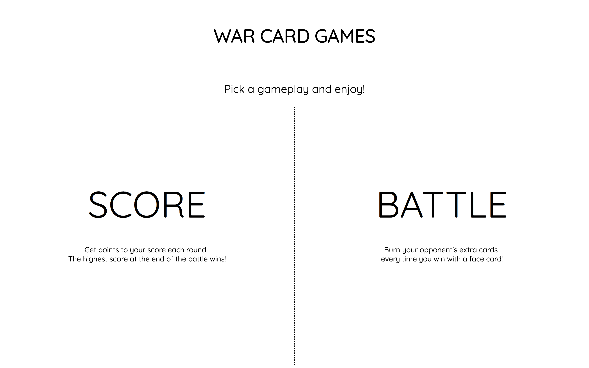
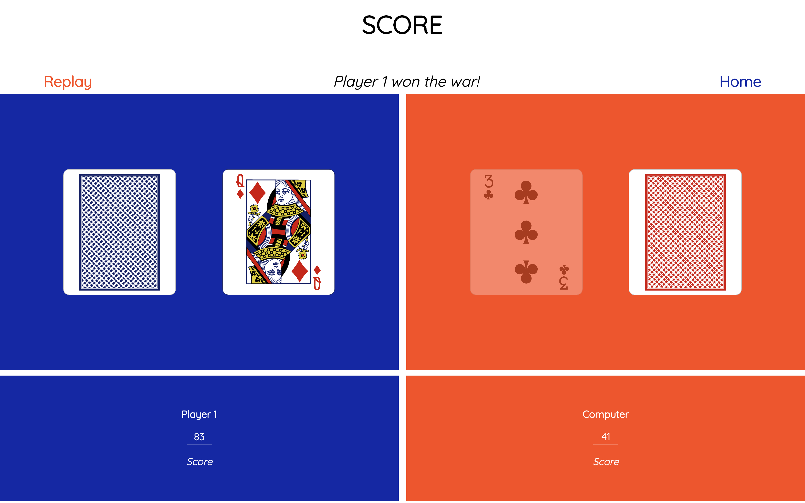
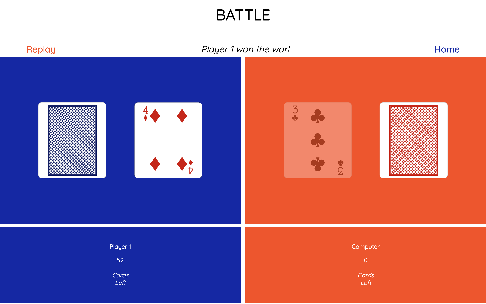

# War Card Games

Two version of the classic card game "war". 
 Both games start with a full card set (excluding the jokers) of 52 cards, shuffled and distributed evenly between you and the computer.
Each round, you play the card at the top of your deck against the computer's card. 

### Score 
The winner of each round get points equal to the difference between both cards.
 When both decks are done, the highest score wins the war!

### Battle
The winner of each round adds to its deck the opponent's card just played. 
 If the battle was won with a Jack, the opponent gives the first card on top of the deck as an extra gain. If the battle was won with a Queen, the two cards on top are added, if it's with a King the top 3 cards and if it's an Ace, the top 4 cards.
  As the classic version, it's the first player with no cards left that looses!

# Technologies Used

HTML5 | CSS3 | Javascript

# Getting Started
(Link Here)

# Next Steps
Adding a choice of card amount to start with (1 deck, 2 decks, etc...).
  Adding songs when a round is won/lost by the player.
  Adding an animation (e.g. fireworks) above winner's deck when the war is over.
